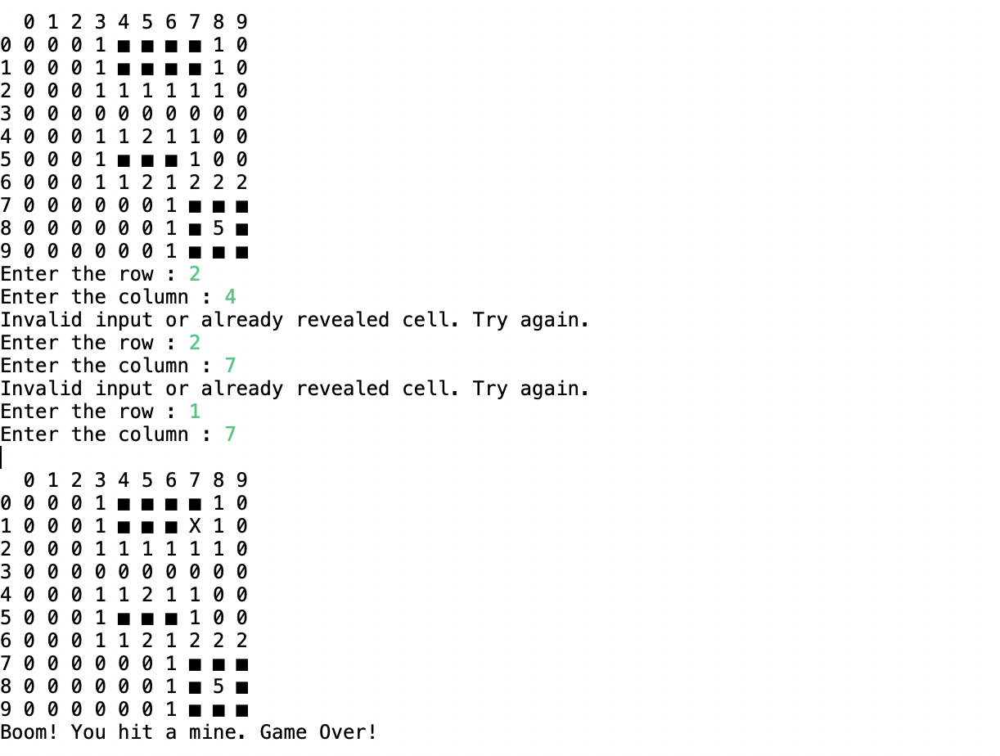

# Minesweeper
- Recreated  a simplified version of the game Minesweeper to be played in the java console. 
- The game is able to randomly generate 10 mines in a 10x10 grid.
-  The user will be able to enter a command that represents a coordinate to check a location for a mine.
- The application will display a number from 0-8 depending on how many mines surround that location.
- If the user selects a mine, the game will respond "boom!" and the game will be lost - If every non-mine square has been revealed, the game is won.
- The grid is rendered to the console after every user command.

